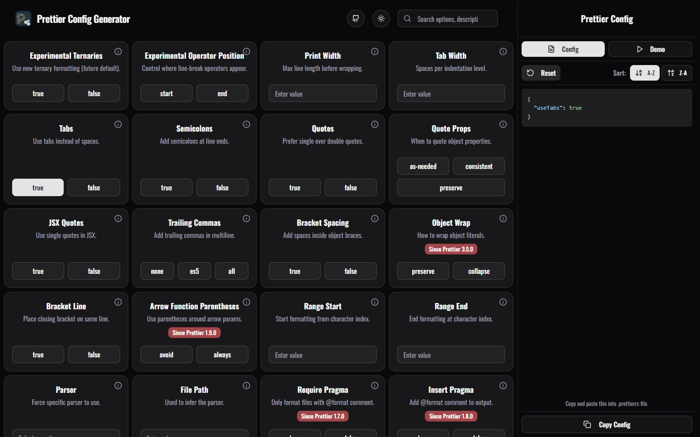

<div align="center">

# 🎨 Prettier Config

### _The fastest way to build, share, and try a Prettier configuration — visually, in your browser._

**Built with Next.js 16, React 19, TypeScript, Tailwind CSS v4, CodeMirror 6, and the official `prettier/standalone`.**

[](https://prettier-config.dev)
[](https://github.com/NooobtimeX/prettier-config)
[](https://opensource.org/licenses/MIT)

</div>

---

## 🧑‍💻 Tech Stack

<div align="center">


</div>

## 🚀 Getting Started

### Prerequisites

- [Bun](https://bun.sh) (recommended) or Node.js & npm/yarn/pnpm

### Installation

```bash
# Clone the repository
git clone https://github.com/NooobtimeX/prettier-config.git

# Install dependencies
bun install

# Start the development server
bun dev
```

The app runs at [http://localhost:2000](http://localhost:2000).

## ✨ Features

The differentiators that put this ahead of the official Prettier playground:

| Feature                     | What it does                                                                                                                                                                                                                                                                                                                |
| --------------------------- | --------------------------------------------------------------------------------------------------------------------------------------------------------------------------------------------------------------------------------------------------------------------------------------------------------------------------- |
| **Round-trip your config**  | Paste an existing `.prettierrc`, `prettier.config.js`, or the `prettier` key from `package.json` — the form populates to match. Use the playground against your real config, then copy or share the updated version.                                                                                                        |
| **Every Prettier version**  | Pick any Prettier 3.x release from `3.0` through `3.6` plus `latest`. Each version's exact option schema is loaded on demand from jsDelivr.                                                                                                                                                                                 |
| **Multi-parser, both tabs** | Paste any supported language in Your Code and the parser is auto-detected (front-matter, root shape, tag patterns) with a manual override. Preview has its own parser dropdown and a purpose-built sample per language so every Prettier option has somewhere to show its effect.                                           |
| **Real code editor**        | CodeMirror 6 with syntax highlighting, line numbers, bracket matching, tab-key indent, and a theme that follows your light/dark preference. Language packs lazy-load per parser.                                                                                                                                            |
| **Shareable URL**           | The Share button packs version + options + code + parser into an LZ-compressed URL hash. Send it anywhere — nothing is sent to a server.                                                                                                                                                                                    |
| **GitHub-style diff**       | Unified or split view, with a `+X −Y` line-change summary on a PR-style header.                                                                                                                                                                                                                                             |
| **AI token counter**        | Live `N → M tokens` badge next to every diff, with a model picker covering GPT-4o, GPT-4, GPT-3.5 (exact BPE), and Claude / Gemini / Llama 3 / Mistral (approximate).                                                                                                                                                       |
| **Surfaced parse errors**   | When Prettier rejects the input, a red strip above the diff shows the exact `SyntaxError (line:column)` instead of silently keeping the unformatted text.                                                                                                                                                                   |
| **Persistent selections**   | Your version + option picks are saved to `localStorage`. A refresh restores everything; the URL hash takes precedence if one is present.                                                                                                                                                                                    |
| **20-language UI**          | Fully localized in English, Thai, Chinese, Spanish, Hindi, German, French, Portuguese, Japanese, Korean, Russian, Vietnamese, Indonesian, Italian, Polish, Turkish, Ukrainian, Bengali, plus Arabic and Persian (both RTL).                                                                                                 |
| **All options covered**     | Every officially supported Prettier option appears with its default value and description, auto-generated from the loaded version's `getSupportInfo()`.                                                                                                                                                                     |
| **Per-language Preview**    | Switch the Preview parser to TypeScript, CSS, SCSS, Less, HTML, Vue, Angular, JSON / JSON5 / JSONC, Markdown, MDX, YAML, or GraphQL and the right mis-formatted sample re-formats under your current config. `proseWrap`, `htmlWhitespaceSensitivity`, `vueIndentScriptAndStyle`, and friends finally have a place to demo. |

### Languages you can format here

TypeScript, JavaScript, Flow, CSS, SCSS, Less, HTML, Vue, Angular templates, JSON, JSON5, JSON with comments, Markdown, MDX, YAML, GraphQL.

### Architecture highlights

- **`prettier/standalone` over CDN.** Each Prettier version's bundle is fetched once from jsDelivr and cached in memory, so switching versions is instant after the first load.
- **Lazy CodeMirror language packs.** Only the JS/TS pack is on the critical path; CSS/HTML/JSON/Markdown/YAML/etc. load when their parser is selected.
- **`useSyncExternalStore` for localStorage.** A single source of truth backs both the version and option selections, with no SSR/CSR mismatch.
- **`lz-string` URL hash.** Same compression scheme as `play.prettier.io`; the entire shared artifact lives client-side.
- **Auto-generated options form.** The options grid is derived from each version's `getSupportInfo()` output, so new Prettier releases get new toggles for free.

## 🏗️ Project Structure

```text
├── app/                    # Next.js App Router (pages + layouts)
│   └── [locale]/           # Locale-aware routes (about, faq, generator)
├── common/                 # Shared constants, enums, interfaces
│   └── messages/           # 15 next-intl translation JSON files
├── components/             # React components
│   ├── CodeEditor.tsx      # CodeMirror 6 wrapper (lazy language packs)
│   ├── CodeDiff.tsx        # GitHub-style diff + token badge
│   ├── ParserPicker.tsx    # Auto-detect + manual parser override
│   ├── PrettierPanel.tsx   # Config / Preview / Your Code tabs (desktop)
│   ├── PrettierPanelModal.tsx  # Same tabs in a mobile-friendly drawer
│   ├── TokenModelPicker.tsx
│   ├── VersionPicker.tsx
│   └── ui/                 # shadcn/ui base components
├── hooks/
│   ├── usePersistedConfig.ts   # localStorage version + options
│   ├── useShareableUrl.ts      # bidirectional URL hash sync
│   ├── usePrettierVersion.ts   # versioned format() + supportInfo
│   └── useDiffSettings.ts
├── lib/
│   ├── prettierLoader.ts   # CDN loader + parser → plugin mapping
│   ├── parsers.ts          # ParserId + detectParser()
│   ├── tokenizers.ts       # exact + approximate token counters
│   ├── adaptSupportInfo.ts # Prettier schema → form metadata
│   └── sample.ts           # Built-in JS/JSX sample
└── public/                 # Static assets, llm.txt, og-image
```

## 🚊 Deployment (Railway)

**[Railway](https://railway.com/) is the only deployment target.** The app runs as a
single service that deploys from `main` — Railway's GitHub integration handles
deploys automatically.

| File             | Role                                                                               |
| :--------------- | :--------------------------------------------------------------------------------- |
| `railway.toml`   | Tells Railway to use the Dockerfile builder, plus start command and restart policy |
| `Dockerfile`     | Three-stage build — Bun installs, Bun builds, **Node serves**                      |
| `.dockerignore`  | Keeps `node_modules`, `.next`, and `.env` out of the build context                 |
| `.tool-versions` | Pins the local toolchain (`bun 1.3.14`, `node 24`) to match the image              |

**Runtimes.** The image **builds with Bun** but **serves under Node**
(`node:24-slim` runner stage, `CMD node server.js`) — Bun's Node-compat HTTP layer
leaks RSS under the Next standalone server
([oven-sh/bun#27514](https://github.com/oven-sh/bun/issues/27514): buffers are freed
by GC but never returned to the OS). Don't move the runner back to Bun until that's
fixed upstream.

**Railway dashboard settings.** Leave the service **Root Directory** at `/` (repo
root). Nothing else needs configuring — `railway.toml` carries the rest.

> [!NOTE]
> **No environment variables are required.** Prettier and every parser plugin are
> fetched client-side from jsDelivr, so there is no backend, no API key, and no
> secret to set. Railway injects `PORT` on its own and the standalone `server.js`
> reads it at startup — never pin `PORT` in the image. (The repo's `.env` sets
> `PORT=2000` for local dev only; `.dockerignore` keeps it out of the build.)

Verify the production image locally before pushing:

```bash
docker build -t prettier-config .
```

```bash
docker run --rm -e PORT=2000 -p 2000:2000 prettier-config
```

## 📸 Screenshots

<div align="center">

### 🎯 Option Selection Interface


_Interactive interface for selecting and configuring Prettier options_

</div>

## 📄 License

This project is licensed under the MIT License - see the [LICENSE](LICENSE) file for details.

## 🙏 Acknowledgments

<div align="center">

|                                            🎉 **Special Thanks**                                            |
| :---------------------------------------------------------------------------------------------------------: |
| 🌟 [**mnicole**](https://github.com/mnicole/prettier-config) - _Original project that this was forked from_ |
|                   💎 [**Prettier Team**](https://prettier.io/) - _Amazing code formatter_                   |
|                   🎨 [**shadcn/ui**](https://ui.shadcn.com/) - _Beautiful UI components_                    |
|                        🚀 [**Next.js**](https://nextjs.org/) - _The React framework_                        |
|                       🚊 [**Railway**](https://railway.com/) - _Deployment platform_                        |
|              ✏️ [**CodeMirror**](https://codemirror.net/) - _The editor in the Your Code tab_               |

</div>

---

<div align="center">

## 📬 Get in Touch

**Questions? Suggestions? We'd love to hear from you!**

[](https://github.com/NooobtimeX/prettier-config/issues)
[](mailto:nooobtimex@gmail.com)

### ⭐ **Found this helpful? Give us a star!**

[](https://github.com/NooobtimeX/prettier-config)

_Your support helps us improve and maintain this project_ 💖

</div>
